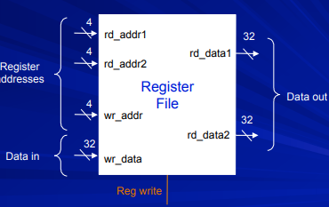
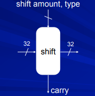
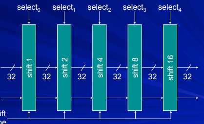

# CPU-ARM
Design, implementation and simulation of a complete ARM based CPU.

### About [ARM](https://www.arm.com/)

An ARM processor is one of a family of CPUs based on the RISC (reduced instruction set computer) architecture developed by Advanced RISC Machines (ARM). ARM makes 32-bit and 64-bit RISC multi-core processors. Click [here](https://en.wikipedia.org/wiki/ARM_architecture) for more.

We divide this making of CPU processor based on ARM instruction set architecture into 2 parts.

- <a href="#part1">1. Design and Implementation</a>
- <a href="#part2">2. Simulation</a>

## Design and Implementation

### VHDL files and their usage

#### Register File

A register file is an array of processor registers in a central processing unit (CPU). Such RAMs are distinguished by having dedicated read and write ports, whereas ordinary multiported SRAMs will usually read and write through the same ports.

We will here implement register file as shown -

- **rd_addr1** and **rd_addr2** are signals as `STD_LOGIC_VECTOR` of 4 bits, containing the register address in reg-file. The data that will get fetched at these 2 addresses will get out from **rd_data1** and **rd_data2** respectively, which are 32 bits `STD_LOGIC_VECTOR`.

- **wr_addr** is the signal which will contain the address of the register in which we shall be writing the correspoding data from the **wr_data** signal.

- **wr_data** is the signal with the data input which shall be written in the register with the address as **wr_addr**.

- Reg write is also needed, whose high state will convey the meaning that their is a need to write in regsiter. We will be implementing it will control signal **RW**. 

#### Shifter

A shifter will shift the input 32-bit data value by a given amount and depending on the input type as Left shift, right shift unsigned, signed right shift and rotation characterised in ARM as LSL, RSL, ASL and ROR respectively.

We will be making 5 different shifting entities which will be shifting the bits through a different amount, which will be 1 bits, 2 bits, 4 bits, 8 bits and 16 bits. For e.g. if we have to shift the 32-bit data input by 25 amount, our shifter architecture will shift it as 1+8+16, where 2 bits and 4 bits will not shift the input.

